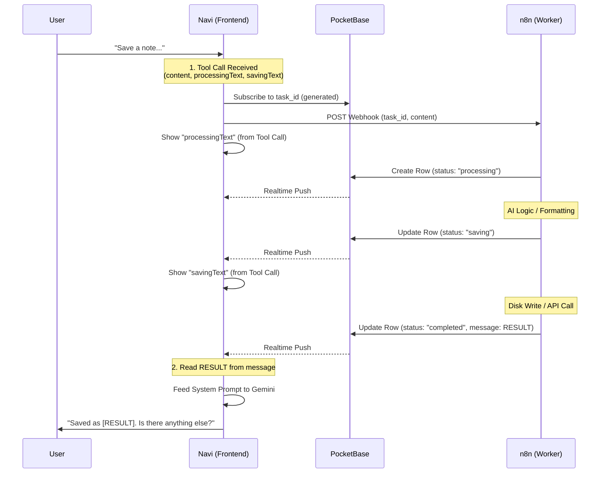

# Navi PWA - Project Analysis

## Overview
Navi is a Progressive Web Application (PWA) designed for iOS, featuring a 3D animated character ("Navi") and integrating with the Gemini Live API for conversational capabilities. It supports voice interaction and text-based chat.

## Tech Stack
- **Framework**: React 19 + Vite 7
- **Language**: TypeScript 5.9
- **Styling**: TailwindCSS 4
- **3D/Animation**: Three.js, Framer Motion
- **AI Integration**: Google GenAI SDK (`@google/genai`)
- **PWA**: `vite-plugin-pwa`
- **Icons**: Lucide React
- **Package Manager**: Bun (recommended)

## Architecture
### Key Components
- **`App.tsx`**: The main entry point and container for the application.
- **`Navi.tsx`**: Renders the 3D character or visual representation of the assistant.
- **`ChatUI.tsx`**: Handles the text-based chat interface and message display.
- **`ControlBar.tsx`**: Provides user controls for microphone and other actions.
- **`SettingsModal.tsx`**: Manages application settings (likely API keys, preferences).

### Hooks
- **`useGeminiLive.ts`**: Manages the connection and interaction with the Gemini Live API.
- **`useAudioCapture.ts`**: Handles microphone input.
- **`useAudioPlayback.ts`**: Handles audio output/response playback.
- **`useLocalStorage.ts`**: Utility for persisting state to local storage.

## Development Workflow

### Build & Run
This project uses **Bun**.

- **Install Dependencies**: `bun install`
- **Start Dev Server**: `bun dev` (runs `vite`)
- **Build for Production**: `bun run build` (runs `tsc -b && vite build`)
- **Lint**: `bun run lint`

## Agent Instructions

> [!IMPORTANT]
> **File Line Ending Handling**
> When using `replace_file_content` **ALWAYS CONVERT THE FILE FIRST** to unix with `dos2unix` to prevent line-ending issues.

## Project Structure
- `src/`: Source code
  - `components/`: UI components
  - `hooks/`: Custom React hooks
  - `utils/`: Utility functions
  - `assets/`: Static assets
- `public/`: Public static files (manifest, icons)

# Navi Realtime Tool Architecture

This document outlines the **Navi Realtime Tool Architecture**. It serves as the blueprint for extending Navi’s capabilities. Any future tool added to Navi (e.g., "Calendar," "Smart Home," "Email") must follow this exact design pattern to ensure consistent realtime feedback and reliable state management.

-----

## 1\. High-Level Overview

The system relies on a **triangular architecture**. Navi (Frontend) does not wait idly for the Backend (n8n). Instead, they communicate asynchronously through a shared Signal Server (PocketBase).

  * **Frontend (Navi):** The Orchestrator. Generates the Task ID and controls the UI experience.
  * **Signal Server (PocketBase):** The State Store. Holds the "Live" status of running tasks.
  * **Worker (n8n):** The Executioner. Performs the heavy logic and reports progress to the Signal Server.

### System URLs

  * **Signal Server:** `https://pb.gisketch.com`
  * **Automation Worker:** `https://automate.gisketch.com`

-----

## 2\. The Data Contract

### A. PocketBase Schema

All tools share a single collection for status updates.

  * **Collection:** `task_updates`
  * **Permissions:** Public Read/Write (controlled via client logic/UUID obfuscation).

| Field | Type | Description |
| :--- | :--- | :--- |
| `task_id` | Text | Unique UUID v4 generated by **Navi** (Frontend). |
| `status` | Text | The lifecycle state: `processing`, `saving`, `completed`, `error`. |
| `message` | Text | Context-dependent payload. <br>• In progress: Empty or debug info.<br>• Completed: The final result (e.g., Filename, JSON data). |

### B. The Gemini Tool Definition Pattern

Every tool defined in Navi **must** include arguments for UI-specific text strings. This allows the AI to "personality-inject" the loading screens dynamically at runtime.

**Standard Tool Definition (Schema):**

```json
{
  "name": "saveNote",
  "description": "Saves a note to the user's obsidian vault.",
  "parameters": {
    "type": "OBJECT",
    "properties": {
      "content": { "type": "STRING", "description": "The note content" },
      "processingText": { "type": "STRING", "description": "Text to show while status = processing (e.g., 'Drafting your note...')" },
      "savingText": { "type": "STRING", "description": "Text to show while status = saving (e.g., 'Writing to Vault...')" }
    },
    "required": ["content", "processingText", "savingText"]
  }
}
```

-----

## 3\. The Standard Workflow (The Blueprint)

When creating a new tool, implement this specific lifecycle:



-----

## 4\. Case Study: The "Save Note" Tool

Here is how the Standard Workflow is implemented for the existing Notes tool.

### Step 1: Frontend (Navi)

1.  **Intent Detected:** User says "Note that I'm thinking of watching Castlevania."
2.  **Tool Execution:** Navi generates a UUID (`task_123`) and constructs the payload.
3.  **UI State:** Navi enters "Listening Mode" on PocketBase channel `task_123`.
4.  **Trigger:** Sends POST to `https://automate.gisketch.com/webhook/save-note`.

### Step 2: Backend (n8n Workflow)

The n8n workflow strictly follows the **3-Stage Update** pattern:

1.  **Stage 1: Processing**

      * *Action:* `HTTP Request` -\> POST to PocketBase.
      * *Payload:* `{ task_id: "task_123", status: "processing", message: "" }`
      * *Logic:* An LLM node takes the raw voice input and formats it into clean Markdown with Frontmatter.

2.  **Stage 2: Saving**

      * *Action:* `HTTP Request` -\> POST to PocketBase.
      * *Payload:* `{ task_id: "task_123", status: "saving", message: "" }`
      * *Logic:* The `Write to Disk` node saves the file to the Obsidian vault.

3.  **Stage 3: Completion**

      * *Action:* `HTTP Request` -\> POST to PocketBase.
      * *Payload:* `{ task_id: "task_123", status: "completed", message: "2025-12-06_castlevania.md" }`
      * *Note:* The `message` field here acts as the return value.

### Step 3: Closing the Loop (Frontend)

1.  Navi receives `{ status: "completed", message: "2025-12-06_castlevania.md" }`.
2.  Navi parses the `message`.
3.  Navi sends a hidden System Prompt to Gemini:
    > *"System: The file '2025-12-06\_castlevania.md' is saved. Your notes task is completed. Respond to the user confirming this."*
4.  Gemini speaks: *"Okay, I've created that note for you. It's saved as 2025-12-06\_castlevania.md."*

-----

## 5\. Developer Guide: How to Add a New Tool

To add a new tool (e.g., "Add to Calendar"), follow these steps:

1.  **n8n Setup:**

      * Create a workflow that accepts `task_id`.
      * Add `HTTP Request` nodes to update PocketBase at every logic step.
      * Ensure the final PocketBase update puts the *result* (e.g., "Meeting created at 5PM") in the `message` field.

2.  **Navi Setup:**

      * Add the function definition to the Gemini API config.
      * **Crucial:** Include arguments for `processingText` ("Checking your schedule...") and `savingText` ("Booking the slot...").
      * Ensure the frontend code maps the `completed` status's `message` field to the system prompt injection.

